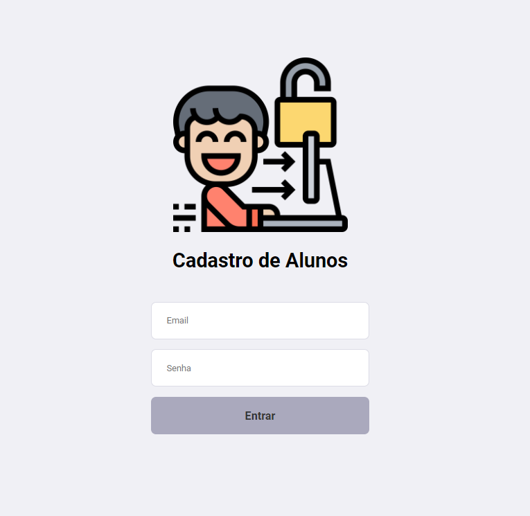
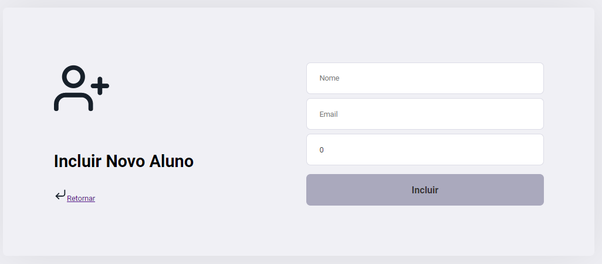
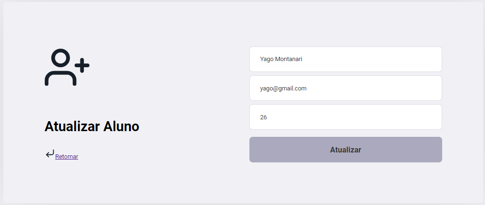
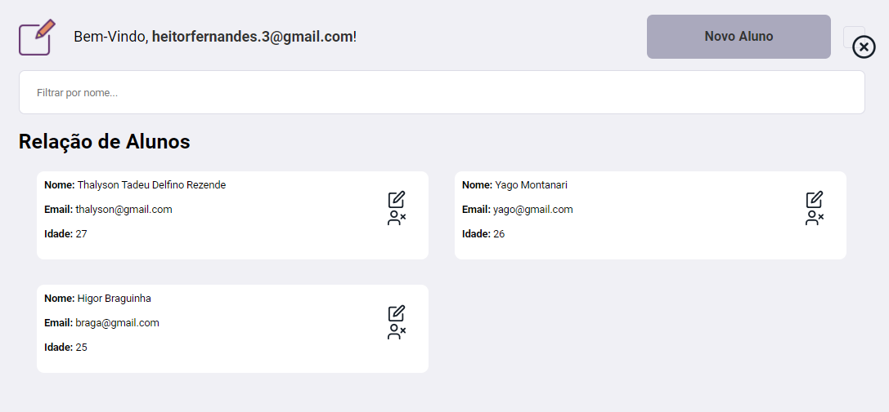
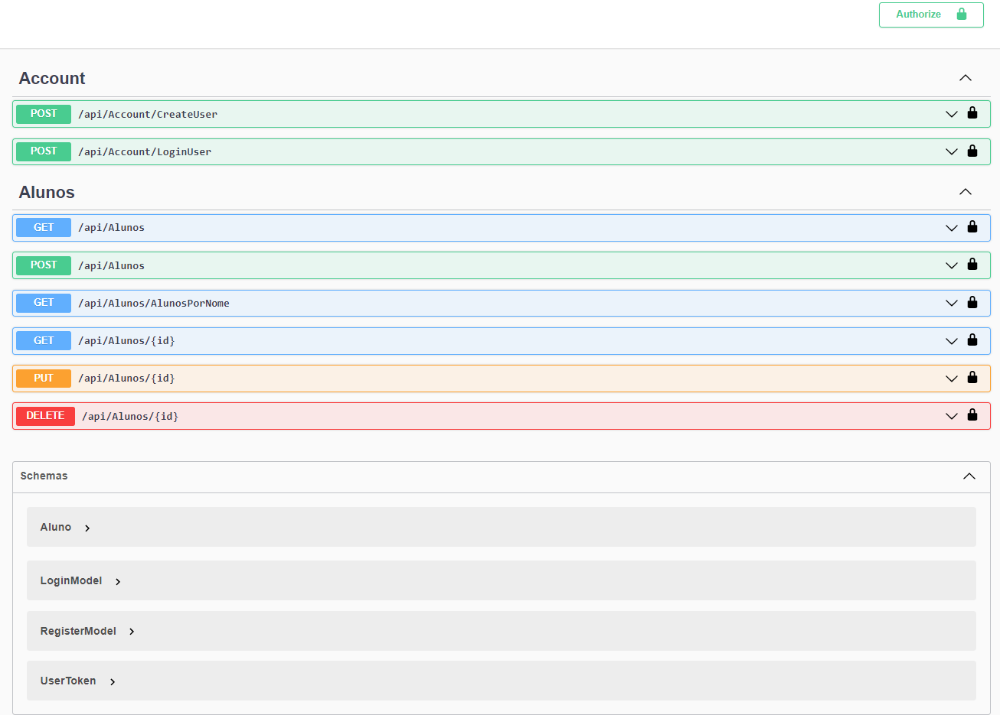

# Gerenciador de alunos

 - Olá este é um projeto criado a partir das vídeo aulas 
  do Professor Macoratti, com o intuito de criar uma API em .NET Core 
  consumi-la através de um front-end construído em React. 

## Primeiros passos para executar o aplicativo React

- Este projeto foi inicializado com [Create React App] (https://github.com/facebook/create-react-app).

### Scripts Disponíveis

- No diretório do projeto, você pode executar:

### `yarn start`

- Executa o aplicativo no modo de desenvolvimento. \
Abra [http: // localhost: 3000] (http: // localhost: 3000) para visualizá-lo no navegador.

 

<h2>Login</h2>

 

<h2>Criar e autalizar</h2>

 

<h2>Listar</h2>

 

## Primeiros passos para executar o aplicativo .NET Core

- No diretório do projeto, você pode executar:

### `dotnet run`

- Executa o aplicativo no modo de desenvolvimento

Abra [https://localhost:5001/swagger/index.html] (https://localhost:5001/swagger/index.html) para visualizá-lo no navegador usando o swagger.

<h2>Rotas</h2>

___

## Funcionalidades

- Criar usuário
- Fazer login
- Criar aluno
- Editar aluno
- Listar aluno
- Listar todos os alunos
- Excluir aluno

___

## 🚀 Tecnologias

 - C#
 - .Net Core 5.0
 - JWT
 - Swagger
 - React 

___

<h3>License</h3> 

This project is under the MIT license. See the LICENSE for more information.